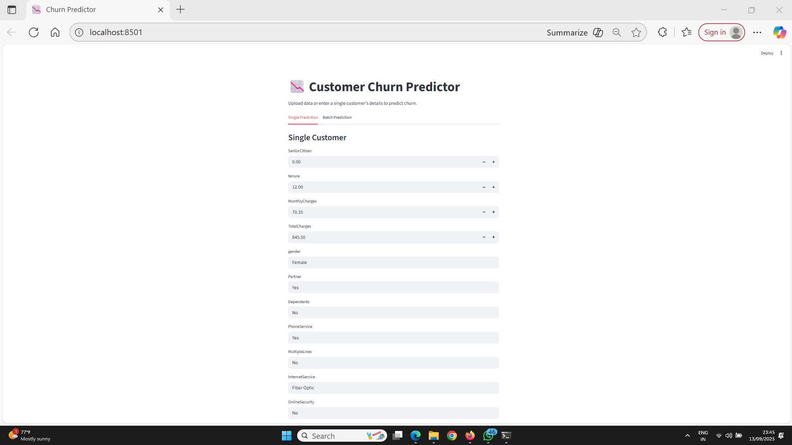
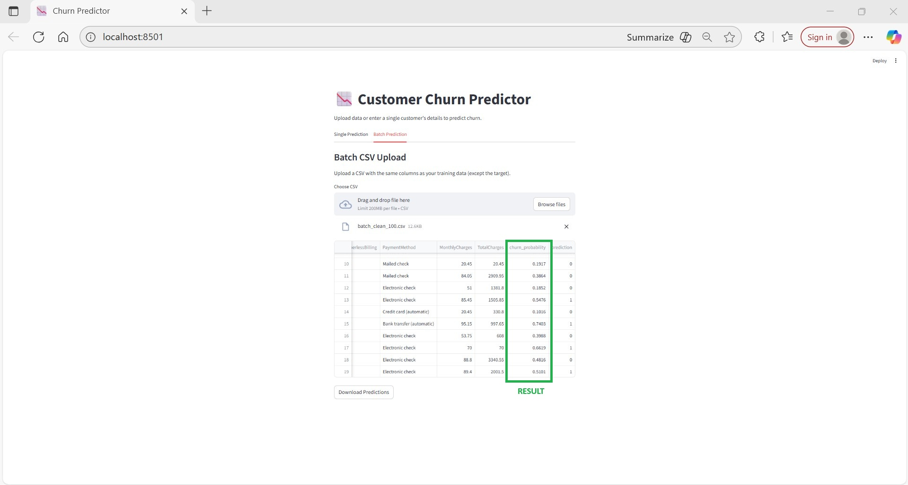
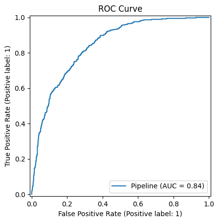
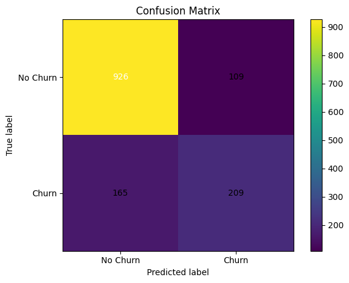

# Customer Churn Prediction (Telco)

End‑to‑end machine‑learning project that predicts whether a telecom customer will churn (leave) or stay.
Built with **Python**, **scikit‑learn**, **XGBoost**, and a **Streamlit** demo app.
## 🔥 Preview (Screenshots)

### Streamlit App – Single Prediction



### Streamlit App – Batch Prediction


### Model Evaluation
ROC Curve | Confusion Matrix
:--:|:--:
 | 

## 🔥 Highlights
- Clean preprocessing with `ColumnTransformer` (numeric + categorical).
- Three models: **Logistic Regression**, **Random Forest**, **XGBoost** — best picked by ROC AUC.
- Saved pipeline (`models/best_model.joblib`) and feature schema (`artifacts/feature_info.json`).
- Visuals in `reports/`: ROC curve & confusion matrix (after you run training).
- Recruiter‑friendly repo: clear structure, commands, and a small web app.

---

## 📦 Project Structure
```text
churn-ml/
├─ app/
│  └─ streamlit_app.py         # Interactive web demo (predict churn for single or batch)
├─ src/
│  └─ train.py                 # One‑click training: preprocess, train, evaluate, save artifacts
├─ data/                       # Put Telco CSV here (ignored by git)
├─ models/                     # Saved model pipeline
├─ artifacts/                  # Feature schema / metadata
├─ reports/                    # ROC curve & confusion matrix images
├─ notebooks/                  # (Optional) EDA notebooks
├─ requirements.txt
├─ LICENSE
├─ .gitignore
└─ README.md
```

## 🗂 Dataset
Use **Telco Customer Churn** (commonly found on Kaggle). Download the CSV and place it as:
```
data/Telco-Customer-Churn.csv
```

## 🚀 Quickstart (Windows)
1. **Install Python 3.11+** from python.org (check “Add Python to PATH”).
2. Open **Command Prompt** in this project folder and run:
   ```bat
   py -m venv .venv
   .venv\Scripts\activate
   pip install --upgrade pip
   pip install -r requirements.txt
   ```
3. Put the dataset at `data/Telco-Customer-Churn.csv`.
4. **Train**:
   ```bat
   python src\train.py --data data\Telco-Customer-Churn.csv
   ```
   Outputs:
   - `models/best_model.joblib`
   - `artifacts/feature_info.json`
   - `reports/roc_curve.png`, `reports/confusion_matrix.png`
   - metrics in the terminal

5. **Demo app**:
   ```bat
   streamlit run app\streamlit_app.py
   ```

## 📊 Expected Metrics (typical on Telco dataset)
- ROC AUC ~ 0.83–0.86
- Accuracy ~ 0.78–0.82
(Your numbers may vary slightly based on random splits and parameters.)

## 🧠 How It Works
- Drops ID columns (e.g., `customerID`).
- Cleans `TotalCharges` to numeric.
- Splits data (stratified) into Train/Test.
- Preprocesses:
  - Numeric: `SimpleImputer` + `StandardScaler`
  - Categorical: `SimpleImputer` + `OneHotEncoder(handle_unknown='ignore')`
- Trains 3 models & selects the one with best ROC AUC.
- Saves the full **pipeline** (preprocessing + model) for reliable predictions.

## 🧪 Reproducibility
- Random seeds fixed where possible.
- Results are saved under `reports/` and can be embedded in this README after you train.

## 🧾 License
MIT — use this freely with attribution.
